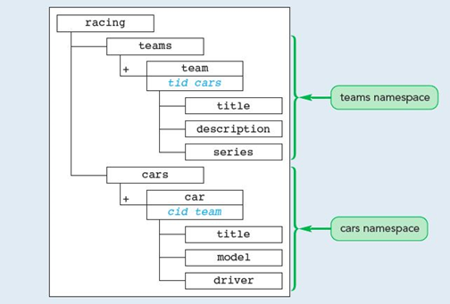
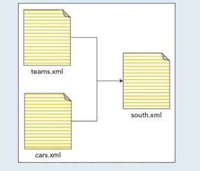

# XML Assignment 1
## COMP - 6000

- 2 XML vocabularies teams.xml, for the team series, and cars.xml, for the cars available for the
racing team based on the description provided

- A souths.xml master document, see the file relationship in Figure 2 that:

1. Contains an internal DTD for the teams and cars name spaces;

2. Uses entities to read information from different documents into the compound document.
